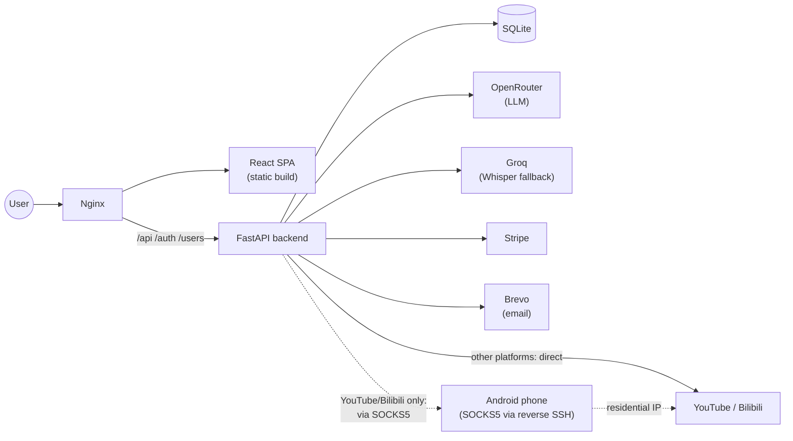

# Video Downloader + AI Summarizer

A full-stack video downloader (YouTube, Bilibili, and 1800+ other sites via
[yt-dlp](https://github.com/yt-dlp/yt-dlp)) with an AI layer on top: streaming
summaries, auto-generated mind maps, and a chat interface to ask questions
about a video's content — plus a complete account system, subscription
billing, multi-language support, and a privacy-conscious admin dashboard.

Built as an end-to-end portfolio project: not just the download/AI core, but
the full surface area of a real product — auth, payments, i18n, deployment,
and the operational issues that come with actually running something in
production.

**Live**: https://getvideodownloader.site (zh / en / pt)

<!-- Add 2-3 screenshots or a short GIF here: homepage, the AI summary panel
mid-stream, and the admin analytics dashboard make a good set. -->

## Features

- **Video/audio download** — three modes (video+audio, video only, audio
  only) across any site yt-dlp supports
- **Custom subtitle extraction** — a dedicated adapter for Bilibili's CC
  subtitle API (its format differs enough from yt-dlp's generic handling that
  a thin platform-specific layer was worth writing), with a generic yt-dlp
  path as fallback for everything else, including a Whisper transcription
  fallback for videos with no subtitles at all
- **AI summarization** — streamed token-by-token over Server-Sent Events, with
  a model fallback chain (OpenRouter → alternate model) and exponential
  backoff retries, so a single provider hiccup doesn't take the feature down
- **Mind maps** — generated from the same summarization pass
- **Q&A chat** — ask follow-up questions about a video's content, grounded in
  its transcript
- **Accounts** — email+password and Google OAuth2, email verification via
  Brevo's API
- **Subscriptions** — Stripe Checkout + webhook-driven state sync (sandbox
  mode; see [Billing](#billing) below)
- **i18n** — Chinese / English / Portuguese, URL-prefix routed (`/`, `/en/`,
  `/pt/`) for SEO rather than cookie-based language switching
- **Admin dashboard** — total users, Pro conversions, AI usage counters, and a
  30-day visitor trend chart, gated behind `is_superuser`
- **Privacy-conscious analytics** — the public visitor counter never stores a
  raw IP; see [Privacy design](#privacy-design-for-visit-analytics)

## Tech stack

| Layer      | Choices |
|------------|---------|
| Backend    | FastAPI, SQLAlchemy (async) + SQLite, `fastapi-users` (JWT + OAuth2), Stripe SDK, httpx |
| Frontend   | React 19, Vite, Tailwind CSS v4, react-router, react-i18next |
| AI         | OpenRouter (LLM, with fallback chain), Groq (Whisper fallback) |
| Infra      | Azure VM (Ubuntu), Nginx, systemd, Namecheap DNS, Brevo (transactional email) |

## Architecture



The dotted path exists because YouTube/Bilibili rate-limit or block requests
from datacenter IPs — which is what every cloud VM has. Only requests to
those two hosts are routed through the tunnel; everything else connects
directly, so an unstable home connection can't degrade unrelated features.
See [Notable decisions](#notable-engineering-decisions) for why this exists
and how it's built.

## Getting started

### Prerequisites
- Python 3.10+
- Node 18+
- API keys for whichever features you want to run (see
  [Environment variables](#environment-variables) — most are optional and the
  app degrades gracefully without them)

### Backend

```bash
cd backend
python -m venv venv
venv\Scripts\activate        # or `source venv/bin/activate` on macOS/Linux
pip install -r requirements.txt
cp .env.example .env         # then fill in the keys you have
python main.py                # http://localhost:8000
```

### Frontend

```bash
cd frontend
npm install
npm run dev                   # http://localhost:5173, proxies /api to :8000
```

## Environment variables

Full list with explanations in [`backend/.env.example`](backend/.env.example)
and [`frontend/.env.example`](frontend/.env.example) — nothing below is a real
value.

| Variable | Required for | Notes |
|---|---|---|
| `AUTH_SECRET` | Everything | Any long random string |
| `OPENROUTER_API_KEY` | AI summarize/chat | Primary LLM provider |
| `GROQ_API_KEY` | AI summarize (no-subtitle case) | Whisper fallback |
| `GOOGLE_OAUTH_CLIENT_ID` / `_SECRET` | "Sign in with Google" | Optional — email+password still works without it |
| `STRIPE_SECRET_KEY` / `STRIPE_PRICE_ID` / `STRIPE_WEBHOOK_SECRET` | Pro subscriptions | Optional, sandbox mode recommended |
| `BILLING_ENABLED` | — | Hard off-switch for the checkout endpoint; keep `false` on any public deployment while Stripe is in test mode |
| `BREVO_API_KEY` / `BREVO_SENDER_EMAIL` / `BREVO_SENDER_NAME` | Verification emails | Skipped silently (logged, not errored) if unset |
| `VISIT_SALT` | Visit analytics | Salts the hashed IP; leave blank to disable the feature |
| `YT_DLP_PROXY` | Bypassing datacenter-IP blocks | Only applied to YouTube/Bilibili requests |

## API overview

| Route | Method | Notes |
|---|---|---|
| `/api/parse`, `/api/download` | POST | Video parsing / download |
| `/api/summarize`, `/api/chat` | POST | SSE streams (`text/event-stream`) |
| `/api/quota` | GET | Remaining daily AI quota for the current user/IP |
| `/api/stats/public`, `/api/stats/admin` | GET | Public visitor count / admin-only dashboard data |
| `/api/billing/checkout`, `/api/billing/webhook` | POST | Stripe Checkout session + webhook receiver |
| `/auth/jwt/login`, `/auth/register`, `/auth/google/*` | — | Provided by `fastapi-users` |

## Notable engineering decisions

**Residential proxy over a reverse SSH tunnel.** YouTube/Bilibili block
datacenter IPs; a paid residential proxy service was the obvious fix but not
a free one. Instead, a spare Android phone (Termux, `sshd` on port 8022)
holds a reverse dynamic port-forward (`ssh -R`) into the server, opening a
SOCKS5 proxy there that egresses through the phone's home broadband. The SSH
key used for the tunnel is scoped with `restrict,port-forwarding` in
`authorized_keys` — it can open ports and nothing else, no shell, no exec.

**Privacy-conscious visit analytics.** The public visitor counter needs
"how many people visited" without ever being able to answer "who visited."
Each row is `(date, sha256(salt + ip))` with a unique constraint on that pair
— same-day repeat visits collapse into one row for free, and the raw IP is
never persisted. The 30-day admin trend chart is a hand-rolled inline SVG
(no charting library) since it's the only chart in the app and only the
admin ever sees it.

**Model fallback + SSE streaming for summaries.** LLM calls go through
OpenRouter with a fallback chain and exponential backoff, so a single
provider's downtime or rate limit doesn't take the feature offline. Output
streams over Server-Sent Events rather than waiting for the full ~1000-word
summary to complete, and rather than a full WebSocket (unneeded for a
one-directional stream).

**A real production incident, debugged end to end.** After deploying email
verification, users saw "verification email sent" but got nothing. Turned
out to be three independent, stacked issues: the Brevo API key was never
copied to the production `.env`; the file that actually calls the email API
(`mailer.py`) had never been deployed at all (an older `users.py` was
running, silently); and even once email was sending, it landed in spam
because the domain's SPF record only authorized Namecheap's forwarding
service, not Brevo's sending IPs. Each layer had to be isolated and fixed
independently — fixing the env var alone did nothing, because the code path
that would have used it wasn't even deployed.

## Deployment

Runs on an Azure VM (Ubuntu) behind Nginx, with the backend managed by
systemd. Backend deploys are a direct file sync + service restart (no build
step — it's plain Python); the frontend is built locally (`vite build`) and
only the `dist/` output is synced to the server's static directory.

Billing is deliberately kept in Stripe sandbox mode — this project
demonstrates a complete payment integration (Checkout Sessions,
signature-verified webhooks, subscription lifecycle sync) without processing
real money.

## Known limitations

Left as-is deliberately, and worth being upfront about:

- **Daily AI quota is in-memory**, keyed by user ID (or IP for anonymous
  users). It resets on restart and wouldn't be shared across multiple
  backend instances — fine at this scale, would move to Redis for real
  horizontal scaling.
- **SQLite**, not Postgres — appropriate for a single-instance personal
  project; a straightforward migration if traffic ever justified it.
- **The residential-proxy tunnel is a zero-budget workaround**, not a
  production-grade solution — a real product at scale would use a paid
  residential proxy provider instead of a phone on a shelf.

## Privacy design for visit analytics

No raw IP address is ever written to disk. Visits are recorded as
`sha256(f"{VISIT_SALT}:{ip}")`, truncated, with a `(date, ip_hash)` uniqueness
constraint doing same-day dedup. The public endpoint only ever returns an
aggregate count for the current month; nothing in the schema can be reversed
back to an individual visitor.

## Acknowledgments

The download core is built entirely on top of
[**yt-dlp**](https://github.com/yt-dlp/yt-dlp) — this project wraps it with an
API, an AI layer, and a product around it, but the actual extraction/download
work for every supported site is yt-dlp's. Full credit to that project and
its contributors.
